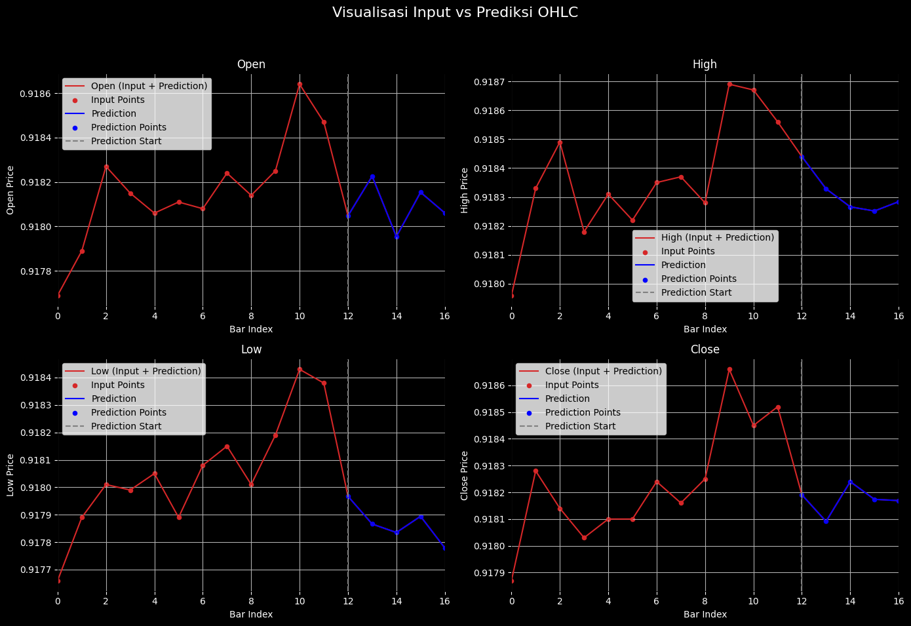

[](https://www.agungg.com/)

# Multi-Step Time Series Forecasting of OHLC Data using LSTM Architecture 


This project demonstrates a robust implementation of multi-step forecasting on forex OHLC (Open, High, Low, Close) data using a LSTM. The model is trained to predict 5 bars (steps) into the future based on the previous 12 bars of input, capturing patterns in all 4 OHLC features simultaneously.

## Acknowledgements

```bash
  Apes Together Strong
```


## Authors


